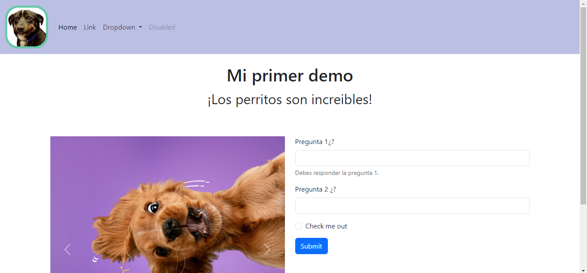

# Mi primer página con Bootstrap de Tecnolochicas PRO

Esta página web fue desarrollada para comenzar a utilizar Bootstrap 5 dentro del Bootcamp de desarrollo front-end de Tecnolochicas.

Fue desarrollado con HTML y Bootstrap.

[Proyecto en línea](https://chic-zabaione-349119.netlify.app/)

- Capturas de pantalla

- Tecnologías

* HTML
* Framework: Bootstrap 5

- Creado por Maria Xitlali Valenzo Serna en el bootcamp de Tecnolochicas Pro